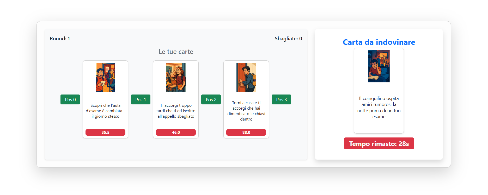
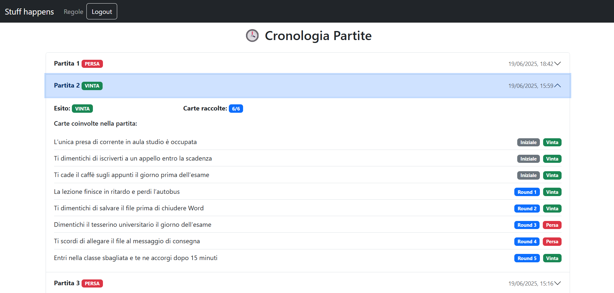

# Gioco della Sfortuna
Progetto individuale sviluppato per il corso **Web Applications I** (A.A. 2024/2025) al **Politecnico di Torino**.
L'applicazione è ispirata al gioco "Stuff Happens", in cui il giocatore deve collocare eventi sfortunati in ordine crescente di gravità.

## Funzionalità principali

L’applicazione web implementa una versione single-player del gioco "Stuff Happens", con le seguenti funzionalità:

- **Gioco completo per utenti registrati**: Partite composte da più round. La partita è vinta se si collezionano 6 carte, mentre è persa se si sbagliano 3 carte.
- **Modalità demo per visitatori**: Una partita da un solo round accessibile senza login.
- **Cronologia partite**: Accessibile solo agli utenti registrati, con riepilogo di ogni carta, esito e round associato.
- **Visualizzazione carte**: Ogni carta mostra nome, immagine e indice di sfortuna (solo se conquistata).
- **Riepilogo finale**: Al termine di ogni partita, l’utente visualizza tutte le carte ottenute.
- **Timer round**: Ogni round ha un limite di tempo di 30 secondi per collocare correttamente la carta.
- **Login/logout**: Autenticazione tramite sessione con credenziali hashate (via Passport.js).


## Tecnologie utilizzate

- **Frontend**: React + Vite, React Router DOM, CSS Modules
- **Backend**: Node.js (ES Modules) + Express
- **Database**: SQLite
- **Autenticazione**: Passport.js + cookie-session, password hash + salt

## Avvio dell'applicazione

> ⚠️ Requisiti:
> - Node.js 22.x LTS
> - nodemon installato globalmente (`npm install -g nodemon`)

### 1. Clona il progetto

```bash
git clone https://github.com/Tomm100/gioco-sfortuna.git
cd gioco-sfortuna
```

### 2. Installa le dipendenze
```bash
cd server
npm install
cd ../client
npm install
```
### 3. Avvia il server e il client (due terminal separati)
```bash
cd server
nodemon index.mjs
```

```bash
cd client
npm run dev
```
L'app sarà visibile su: http://localhost:5173

## Users Credentials

User 1:
  - username: tommaso@example.com
  - password: password  

User 2:  
  - username: bob@example.com
  - password: password 
> ⚠️ Le credenziali inserite sono solo a scopo di testing e non rappresentano utenti reali.

## React Client Application Routes

- Route `/`: Homepage pubblica dell’applicazione. Mostra una breve introduzione per utenti non loggati, un link al login e un bottone per iniziare una partita demo. Accessibile solo da utenti non autenticati.

- Route `/regole`: Pagina con le istruzioni dettagliate del gioco, accessibile da chiunque.

- Route `/login`: Pagina per effettuare l'autenticazione. Dopo il login, l’utente viene reindirizzato alla sua dashboard.

- Route `/user`: Dashboard dell’utente registrato. Consente di iniziare una nuova partita o accedere alla cronologia delle partite completate.

- Route `/user/game/:gameId`: Pagina di gioco principale per utenti registrati. Mostra le carte in possesso e la nuova carta da collocare. 
  Il parametro `:gameId` identifica la partita in corso.

- Route `/user/game/:gameId/summary`: Pagina accessibile solo agli utenti autenticati. Mostra il riepilogo della partita appena completata, includendo:
  - L’esito della partita (vinta o persa)
  - L’elenco completo delle carte raccolte (nome, immagine e indice di sfortuna)
  - Un pulsante per iniziare una nuova partita
  - Un pulsante per tornare alla dashboard utente

  Il parametro `:gameId` identifica la partita in corso.


- Route `/user/storico`: Pagina accessibile solo agli utenti autenticati. Mostra la cronologia delle partite completate, ordinate per data decrescente. Per ogni partita sono riportati:
  - L’esito finale (vinta o persa)
  - Il numero totale di carte raccolte 
  - La lista delle carte coinvolte, con:
    - Nome della situazione orribile
    - Etichetta “Iniziale” se la carta era tra le 3 iniziali
    - Etichetta “Round N” per le carte presentate nei vari round
    - Stato “Vinta” se la carta è stata ottenuta, “Persa” se non è stata vinta

- Route `/demo/game/:gameId`: Pagina accessibile senza effettuare il login. Permette di giocare una partita demo composta da un solo round. Il giocatore riceve 3 carte iniziali e deve collocare correttamente una situazione aggiuntiva. Il parametro `:gameId` identifica la partita demo in corso.

- Route `/demo/game/:gameId/summary`: Riepilogo della partita demo. Mostra le carte iniziali e, se il round è stato vinto, anche la carta ottenuta. Disponibile solo dopo aver completato la demo. Il parametro `:gameId` identifica la partita demo in appena completata.

- Route `*`: Pagina per route non valide. Mostra un semplice messaggio di errore "404 Pagina non trovata" e un bottone per tornare alla home.
  

## API REST

### **API di Autenticazione**

#### **Login**
- **URL**: `/api/sessions`
- **Metodo HTTP**: POST
- **Descrizione**: Autentica un utente e crea una sessione.
- **Corpo della richiesta**:
```json
{
  "username": "user@example.com",
  "password": "password123"
}
```
- **Risposta**: `201 Created` (successo) o `401 Unauthorized` (credenziali non valide).
- **Corpo della risposta**:
```json
{
  "id": 1,
  "username": "user@example.com"
}
```

#### **Ottieni utente corrente**
- **URL**: `/api/sessions/current`
- **Metodo HTTP**: GET
- **Descrizione**: Recupera le informazioni dell'utente attualmente autenticato.
- **Risposta**: `200 OK` (successo) o `401 Unauthorized` (non autenticato).
- **Corpo della risposta**:
```json
{
  "id": 1,
  "username": "user@example.com"
}
```

#### **Logout**
- **URL**: `/api/sessions/current`
- **Metodo HTTP**: DELETE
- **Descrizione**: Termina la sessione dell'utente corrente.
- **Risposta**: `200 OK` (successo).
- **Corpo della risposta**: *Nessuno*

### **API Partite Utente** *(Richiede Autenticazione)*

#### **Crea una nuova partita**
- **URL**: `/api/user/game`
- **Metodo HTTP**: POST
- **Descrizione**: Crea una nuova partita per l'utente autenticato con 3 carte iniziali.
- **Risposta**: `201 Created` (successo), `401 Unauthorized` (non autenticato) o `500 Internal Server Error` (errore generico).
- **Corpo della risposta**:
```json
{
  "gameId": 123,
  "initialCards": [
    {
      "id": 1,
      "name": "Nome Carta",
      "image": "card_image.jpg",
      "badluck": 30
    },
    ...
  ]
}
```

#### **Ottieni prossima carta da indovinare**
- **URL**: `/api/user/game/:gameId/next`
- **Metodo HTTP**: GET
- **Descrizione**: Ottieni la prossima carta da indovinare per la partita specificata.
- **Risposta**: `200 OK` (successo), `404 Not Found` (partita non trovata), `400 Bad Request` (partita già conclusa), o `401 Unauthorized` (non autenticato).
- **Corpo della risposta**:
```json
{
  "id": 5,
  "name": "Nuova Carta",
  "image": "new_card.jpg"
}
```

#### **Invia posizione da indovinare**
- **URL**: `/api/user/game/:gameId/guess`
- **Metodo HTTP**: POST
- **Descrizione**: Invia una proposta di posizione per una carta nella partita specificata
- **Corpo della richiesta**:
```json
{
  "cardId": 5,
  "position": 2
}
```
- **Risposta**: `200 OK` (successo), `404 Not Found` (partita/carta non trovata), `422 Unprocessable Entity` (errore di validazione), o `401 Unauthorized` (non autenticato).
- **Corpo della risposta**:
```json
{
  "result": "correct",
  "card": {
    "id": 5,
    "name": "Nome Carta",
    "image": "card_image.jpg",
    "badluck": 45
  },
  "numPlayerCards": 4,
  "gameStatus": "ongoing"
}
```
*oppure per tentativo sbagliato:*
```json
{
  "result": "wrong",
  "gameStatus": "ongoing",
  "wrongGuesses": 1
}
```

#### **Gestisci timeout**
- **URL**: `/api/user/game/:gameId/timeout`
- **Metodo HTTP**: POST
- **Descrizione**: Gestisce il timeout per una carta, quando il giocatore non effettua una scelta entro 30 secondi.
- **Corpo della richiesta**:
```json
{
  "cardId": 5
}
```
- **Risposta**: `200 OK` (successo), `404 Not Found` (partita/round non trovato), `400 Bad Request` (tempo non scaduto), o `401 Unauthorized` (non autenticato).
- **Corpo della risposta**:
```json
{
  "result": "wrong",
  "gameStatus": "ongoing",
  "wrongGuesses": 2
}
```
#### **Ottieni lo stato di una partita**
- **URL**: `/api/user/game/:gameId`
- **Metodo HTTP**: GET
- **Descrizione**: Recupera lo stato attuale di una partita specifica.
- **Risposta**: `200 OK` (successo), `404 Not Found` (partita non trovata), o `401 Unauthorized` (non autenticato).
- **Corpo della risposta**:
```json
{
  "playerCards": [
    {
      "id": 1,
      "name": "Nome Carta",
      "image": "card_image.jpg",
      "badluck": 30
    },
    ...
  ],
  "roundNumber": 5,
  "wrongGuesses": 1,
  "gameStatus": "ongoing"
}
```

#### **Ottieni cronologia partite utente**
- **URL**: `/api/user/games`
- **Metodo HTTP**: GET
- **Descrizione**: Recupera tutte le partite completate dell'utente autenticato con cronologia dettagliata.
- **Risposta**: `200 OK` (successo), `401 Unauthorized` (non autenticato), o `500 Internal Server Error` (errore generico).
- **Corpo della risposta**:
```json
[
  {
    "gameId": 123,
    "status": "won",
    "startedAt": "2025-06-19T10:30:00Z",
    "totalCardsCollected": 6,
    "cards": [
      {
        "id": 1,
        "name": "Nome Carta",
        "roundNumber": null,
        "isWon": true,
        "isInitial": true
      },
      {
        "id": 3,
        "name": "Altra Carta",
        "roundNumber": null,
        "isWon": true,
        "isInitial": true
      },
      {
        "id": 7,
        "name": "Terza Carta",
        "roundNumber": null,
        "isWon": true,
        "isInitial": true
      },
      {
        "id": 5,
        "name": "Carta Round 1",
        "roundNumber": 1,
        "isWon": true,
        "isInitial": false
      },
      {
        "id": 8,
        "name": "Carta Round 2",
        "roundNumber": 2,
        "isWon": false,
        "isInitial": false
      }
    ]
  }
]
```

### **API Partite Demo** *(Nessuna Autenticazione Richiesta)*

#### **Crea partita demo**
- **URL**: `/api/demo/game`
- **Metodo HTTP**: POST
- **Descrizione**: Crea una nuova partita demo (singolo round) con 3 carte iniziali selezionate casualmente dal server.
- **Risposta**: `201 Created` (successo) o `500 Internal Server Error` (errore generico).
- **Corpo della risposta**:
```json
{
  "gameId": 456,
  "initialCards": [
    {
      "id": 1,
      "name": "Nome Carta",
      "image": "card_image.jpg",
      "badluck": 30
    },
    {
      "id": 4,
      "name": "Carta Demo",
      "image": "demo_card.jpg",
      "badluck": 55
    },
    {
      "id": 9,
      "name": "Ultima Carta",
      "image": "last_card.jpg",
      "badluck": 75
    }
  ]
}
```

#### **Ottieni prossima carta demo**
- **URL**: `/api/demo/game/:gameId/next`
- **Metodo HTTP**: GET
- **Descrizione**: Ottiene la prossima carta da indovinare nella partita demo. Il server seleziona automaticamente una carta casuale non utilizzata.
- **Risposta**: `200 OK` (successo), `404 Not Found` (partita non trovata), o `400 Bad Request` (partita già conclusa).
- **Corpo della risposta**:
```json
{
  "id": 5,
  "name": "Carta Demo",
  "image": "demo_card.jpg"
}
```
#### **Invia tentativo demo**
- **URL**: `/api/demo/game/:gameId/guess`
- **Metodo HTTP**: POST
- **Descrizione**: Invia un tentativo di posizionamento per una carta nella partita demo.
- **Corpo della richiesta**:
```json
{
  "cardId": 5,
  "position": 1
}
```
- **Risposta**: `200 OK` (successo), `404 Not Found` (partita/carta non trovata), o `422 Unprocessable Entity` (errore di validazione).
- **Corpo della risposta** (tentativo corretto - partita vinta):
```json
{
  "result": "correct",
  "card": {
    "id": 5,
    "name": "Nome Carta",
    "image": "card_image.jpg",
    "badluck": 25
  },
  "gameStatus": "won"
}
```
- **Corpo della risposta** (tentativo sbagliato - partita persa):
```json
{
  "result": "wrong",
  "gameStatus": "lost"
}
```

#### **Gestisci timeout demo**
- **URL**: `/api/demo/game/:gameId/timeout`
- **Metodo HTTP**: POST
- **Descrizione**: Gestisce il timeout per un tentativo di carta nella partita demo.
- **Corpo della richiesta**:
```json
{
  "cardId": 5
}
```
- **Risposta**: `200 OK` (successo), `404 Not Found` (partita/round non trovato), o `400 Bad Request` (tempo non scaduto).
- **Corpo della risposta**:
```json
{
  "result": "wrong",
  "gameStatus": "lost"
}
```

#### **Ottieni stato partita demo**
- **URL**: `/api/demo/game/:gameId`
- **Metodo HTTP**: GET
- **Descrizione**: Recupera lo stato attuale di una partita demo.
- **Risposta**: `200 OK` (successo) o `404 Not Found` (partita non trovata).
- **Corpo della risposta**:
```json
{
  "playerCards": [
    {
      "id": 1,
      "name": "Nome Carta",
      "image": "card_image.jpg",
      "badluck": 30
    },
    {
      "id": 4,
      "name": "Carta Demo",
      "image": "demo_card.jpg",
      "badluck": 55
    },
    {
      "id": 9,
      "name": "Ultima Carta", 
      "image": "last_card.jpg",
      "badluck": 75
    }
  ],
  "gameStatus": "ongoing"
}
```


## Database Tables

- **`users`** - Contiene le credenziali degli utenti registrati:
  - `id` – Chiave primaria
  - `name` – Nome completo dell'utente
  - `email` – Email per il login
  - `password` – Password in formato hashato
  - `salt` – Valore salt per hashing sicuro

- **`cards`** - Contiene tutte le carte disponibili nel gioco:
  - `id` – Chiave primaria
  - `name` – Descrizione della situazione sfortunata
  - `img` – Nome del file immagine associato
  - `badluck` – Valore numerico dell’indice di sfortuna (da 1.0 a 100.0)

- **`games`** – Contiene tutte le partite giocate dagli utenti:
  - `id` – Chiave primaria
  - `userId` – Riferimento all’utente
  - `startedAt` – Data e ora di inizio della partita
  - `status` – stato della partita (`ongoing`, `won`, `lost`)

- **`initialCards`** – Contiene le 3 carte iniziali di ogni partita:
  - `id` – Chiave primaria
  - `gameId` – Riferimento alla partita
  - `cardId` – Riferimento alla carta iniziale

- **`gameCards`** – Contiene per ogni partita le carte di ciascun round:
  - `id` – Chiave primaria
  - `gameId` – Riferimento alla partita
  - `cardId` – Carta mostrata nel round
  - `roundNumber` – Numero del round
  - `guessed` – Flag (0/1) per indicare se la carta è stata indovinata o meno
  - `startedAt` – Timestamp di inizio del round


## Main React Components

- `LoginForm` (in `AuthComponents.jsx`): Gestisce l'autenticazione dell'utente con validazione del form e stato di caricamento.

- `CardItem` (in `CardItem.jsx`): visualizza una singola carta con immagine, nome e indice di sfortuna in un layout compatto.

- `GameBoard` (in `GameBoard.jsx`): Rappresenta l’interfaccia di gioco con le carte e i pulsanti per selezionare la posizione.

- `RoundPrompt` (in `RoundPrompt.jsx`): Componente principale per un singolo round, gestisce timer, visualizzazione della carta e interazione utente.

- `Timer` (in `Timer.jsx`): Mostra il conto alla rovescia per ogni round.

- `CardsSummaryBox` (in `CardsSummaryBox.jsx`): Mostra una griglia delle carte conquistate alla fine di una partita completata.

- `NewGameModal` (in `NewGameModal.jsx`): Finestra per avviare una nuova partita per utenti autenticati.

- `NewDemoGameModal` (in `NewDemoGameModal.jsx`): Finestra per iniziare una partita demo per utenti non loggati.

- `ModalResultRound` (in `ModalResultRound.jsx`): Mostra i risultati del round appena completato oppure il messaggio introduttivo se si tratta del primo round.

- `NavHeader` (in `NavHeader.jsx`): Barra di navigazione principale con funzionalità di login/logout e gestione delle route.

- `DefaultLayout` (in `DefaultLayout.jsx`): Layout di base che fornisce una struttura coerente tra le varie pagine.

## Screenshot

**Screenshot durante una partita**



**Screenshot cronologia**




## Licenza

Questo progetto è rilasciato sotto licenza MIT. Vedi il file [LICENSE](./LICENSE) per i dettagli.
